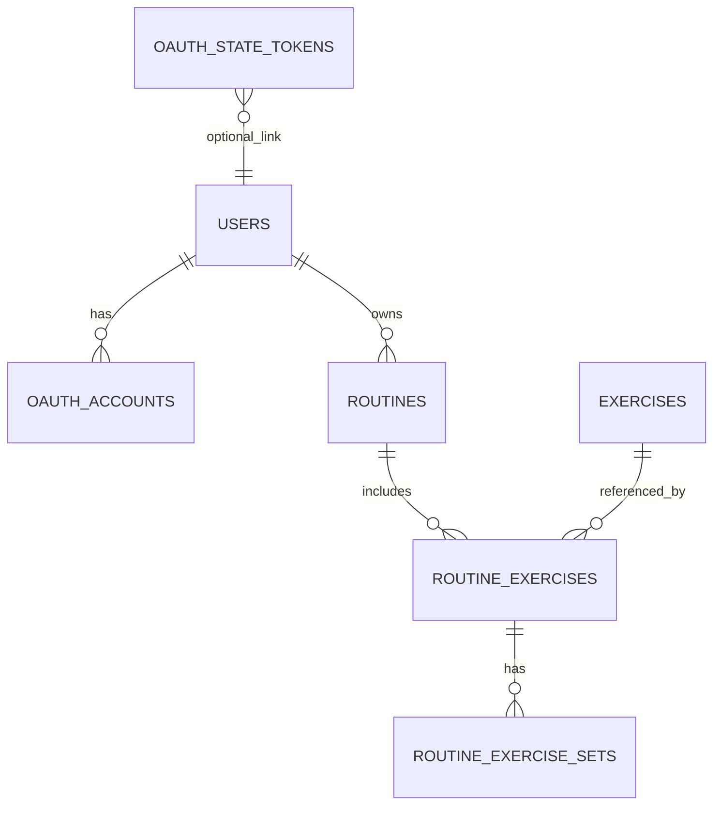

# DB 설계서 (OAuth2 사용자 + 운동 루틴)

## 1. 목표

이 문서는 아래 요구사항을 만족하는 최소/확장 가능한 DB 모델을 정의한다.

- OAuth2 로그인 시 사용자 생성
- 사용자 식별 기준은 `email`
- 사용자는 운동 루틴 목록을 가짐
- 운동 루틴은 운동과 연결 관계를 가짐
- 운동은 상세 정보를 가짐

## 2. 설계 원칙

- `email`은 로그인/사용자 식별용 비즈니스 키로 사용한다. (`users.email` 유니크)
- 내부 참조 안정성을 위해 PK는 `UUID`를 사용한다. (이메일 변경 시 FK 연쇄 수정 방지)
- OAuth 계정 정보(`provider`, `provider_user_id`)와 사용자 프로필은 분리 저장한다.
- 루틴-운동은 N:M 관계를 `routine_exercises`로 해소하고, 정렬 순서 및 목표값을 함께 저장한다.
- 세트 단위 상세값이 필요할 때를 위해 `routine_exercise_sets`를 둔다.

## 3. ERD



## 4. 테이블 정의

### 4.1 `users`

- 사용자 기본 정보
- `email`은 케이스 무시 비교(`citext`) + 유니크

주요 컬럼:
- `id` (PK, UUID)
- `email` (UNIQUE, NOT NULL)
- `display_name`
- `profile_image_url`
- `created_at`, `updated_at`, `deleted_at`

### 4.2 `oauth_accounts`

- OAuth 제공자 계정과 내부 사용자 매핑
- 동일 provider 계정 중복 연결 방지

주요 컬럼:
- `id` (PK)
- `user_id` (FK -> users.id)
- `provider` (예: `google`)
- `provider_user_id` (Google `sub`)
- `email_at_provider`
- `access_token_encrypted`, `refresh_token_encrypted` (선택)
- `token_expires_at`, `scope`

유니크:
- `(provider, provider_user_id)`
- `(user_id, provider)`

### 4.3 `oauth_state_tokens`

- OAuth `state` 일회성 검증용 저장소
- 현재 in-memory 구현을 DB로 확장할 때 사용

주요 컬럼:
- `state` (PK)
- `provider`
- `redirect_uri`
- `expires_at`
- `used_at`

### 4.4 `exercises`

운동 마스터 테이블. 요구사항 기준으로 필요한 상세 정보만 포함:

- 분류: `exercise_type` (`strength`/`cardio`), `body_part`
- 표시: `name`, `description`, `instructions`
- 난이도/장비: `difficulty`, `equipment`
- 운동 타겟: `primary_muscles`, `secondary_muscles`
- 기본값: `default_rest_seconds`

주요 컬럼:
- `id` (PK)
- `code` (UNIQUE, 시스템 코드)
- `name`
- `exercise_type`
- `body_part`
- `equipment` (text[])
- `difficulty`
- `description`
- `instructions` (text[])
- `primary_muscles`, `secondary_muscles` (text[])
- `default_rest_seconds`
- `is_active`

### 4.5 `routines`

- 사용자별 루틴 목록

주요 컬럼:
- `id` (PK)
- `user_id` (FK -> users.id)
- `title`
- `description`
- `last_used_at`
- `created_at`, `updated_at`

### 4.6 `routine_exercises`

- 루틴과 운동 연결 테이블
- 운동 순서 + 목표값 저장

주요 컬럼:
- `id` (PK)
- `routine_id` (FK -> routines.id)
- `exercise_id` (FK -> exercises.id)
- `order_no` (루틴 내 순서)
- `metric_type` (`set_based` / `duration_based`)
- `target_sets`, `target_reps`, `target_weight_kg`
- `target_duration_seconds`
- `rest_seconds`
- `notes`

유니크:
- `(routine_id, order_no)`

### 4.7 `routine_exercise_sets`

- 세트별 상세값이 필요한 경우 사용
- 예: 1세트 60kg 10회, 2세트 65kg 8회

주요 컬럼:
- `id` (PK)
- `routine_exercise_id` (FK -> routine_exercises.id)
- `set_no`
- `target_weight_kg`, `target_reps`, `target_duration_seconds`

유니크:
- `(routine_exercise_id, set_no)`

## 5. PostgreSQL DDL (초안)

```sql
-- UUID, CITEXT 사용
CREATE EXTENSION IF NOT EXISTS pgcrypto;
CREATE EXTENSION IF NOT EXISTS citext;

CREATE TABLE users (
  id UUID PRIMARY KEY DEFAULT gen_random_uuid(),
  email CITEXT NOT NULL UNIQUE,
  display_name VARCHAR(80),
  profile_image_url TEXT,
  created_at TIMESTAMPTZ NOT NULL DEFAULT now(),
  updated_at TIMESTAMPTZ NOT NULL DEFAULT now(),
  deleted_at TIMESTAMPTZ
);

CREATE TABLE oauth_accounts (
  id UUID PRIMARY KEY DEFAULT gen_random_uuid(),
  user_id UUID NOT NULL REFERENCES users(id) ON DELETE CASCADE,
  provider VARCHAR(20) NOT NULL CHECK (provider IN ('google')),
  provider_user_id VARCHAR(191) NOT NULL,
  email_at_provider CITEXT,
  access_token_encrypted TEXT,
  refresh_token_encrypted TEXT,
  token_expires_at TIMESTAMPTZ,
  scope TEXT,
  created_at TIMESTAMPTZ NOT NULL DEFAULT now(),
  updated_at TIMESTAMPTZ NOT NULL DEFAULT now(),
  UNIQUE (provider, provider_user_id),
  UNIQUE (user_id, provider)
);

CREATE INDEX idx_oauth_accounts_user_id ON oauth_accounts(user_id);

CREATE TABLE oauth_state_tokens (
  state VARCHAR(128) PRIMARY KEY,
  provider VARCHAR(20) NOT NULL CHECK (provider IN ('google')),
  redirect_uri TEXT NOT NULL,
  user_id UUID REFERENCES users(id) ON DELETE SET NULL,
  expires_at TIMESTAMPTZ NOT NULL,
  used_at TIMESTAMPTZ,
  created_at TIMESTAMPTZ NOT NULL DEFAULT now()
);

CREATE INDEX idx_oauth_state_tokens_expires_at ON oauth_state_tokens(expires_at);

CREATE TABLE exercises (
  id UUID PRIMARY KEY DEFAULT gen_random_uuid(),
  code VARCHAR(80) NOT NULL UNIQUE,
  name VARCHAR(100) NOT NULL,
  exercise_type VARCHAR(20) NOT NULL CHECK (exercise_type IN ('strength', 'cardio')),
  body_part VARCHAR(30) NOT NULL,
  equipment TEXT[] NOT NULL DEFAULT '{}',
  difficulty VARCHAR(20) CHECK (difficulty IN ('beginner', 'intermediate', 'advanced')),
  description TEXT,
  instructions TEXT[] NOT NULL DEFAULT '{}',
  primary_muscles TEXT[] NOT NULL DEFAULT '{}',
  secondary_muscles TEXT[] NOT NULL DEFAULT '{}',
  default_rest_seconds INTEGER CHECK (default_rest_seconds IS NULL OR default_rest_seconds >= 0),
  is_active BOOLEAN NOT NULL DEFAULT TRUE,
  created_at TIMESTAMPTZ NOT NULL DEFAULT now(),
  updated_at TIMESTAMPTZ NOT NULL DEFAULT now()
);

CREATE INDEX idx_exercises_body_part_type ON exercises(body_part, exercise_type);

CREATE TABLE routines (
  id UUID PRIMARY KEY DEFAULT gen_random_uuid(),
  user_id UUID NOT NULL REFERENCES users(id) ON DELETE CASCADE,
  title VARCHAR(80) NOT NULL,
  description TEXT,
  last_used_at TIMESTAMPTZ,
  created_at TIMESTAMPTZ NOT NULL DEFAULT now(),
  updated_at TIMESTAMPTZ NOT NULL DEFAULT now()
);

CREATE INDEX idx_routines_user_id_created_at ON routines(user_id, created_at DESC);

CREATE TABLE routine_exercises (
  id UUID PRIMARY KEY DEFAULT gen_random_uuid(),
  routine_id UUID NOT NULL REFERENCES routines(id) ON DELETE CASCADE,
  exercise_id UUID NOT NULL REFERENCES exercises(id) ON DELETE RESTRICT,
  order_no INTEGER NOT NULL CHECK (order_no > 0),
  metric_type VARCHAR(20) NOT NULL CHECK (metric_type IN ('set_based', 'duration_based')),
  target_sets SMALLINT CHECK (target_sets IS NULL OR target_sets > 0),
  target_reps SMALLINT CHECK (target_reps IS NULL OR target_reps > 0),
  target_weight_kg NUMERIC(6,2) CHECK (target_weight_kg IS NULL OR target_weight_kg >= 0),
  target_duration_seconds INTEGER CHECK (target_duration_seconds IS NULL OR target_duration_seconds > 0),
  rest_seconds INTEGER CHECK (rest_seconds IS NULL OR rest_seconds >= 0),
  notes VARCHAR(500),
  created_at TIMESTAMPTZ NOT NULL DEFAULT now(),
  updated_at TIMESTAMPTZ NOT NULL DEFAULT now(),
  UNIQUE (routine_id, order_no),
  CHECK (
    (metric_type = 'set_based' AND target_sets IS NOT NULL AND target_duration_seconds IS NULL)
    OR
    (metric_type = 'duration_based' AND target_duration_seconds IS NOT NULL AND target_sets IS NULL)
  )
);

CREATE INDEX idx_routine_exercises_routine_id_order_no ON routine_exercises(routine_id, order_no);
CREATE INDEX idx_routine_exercises_exercise_id ON routine_exercises(exercise_id);

CREATE TABLE routine_exercise_sets (
  id UUID PRIMARY KEY DEFAULT gen_random_uuid(),
  routine_exercise_id UUID NOT NULL REFERENCES routine_exercises(id) ON DELETE CASCADE,
  set_no SMALLINT NOT NULL CHECK (set_no > 0),
  target_weight_kg NUMERIC(6,2) CHECK (target_weight_kg IS NULL OR target_weight_kg >= 0),
  target_reps SMALLINT CHECK (target_reps IS NULL OR target_reps > 0),
  target_duration_seconds INTEGER CHECK (target_duration_seconds IS NULL OR target_duration_seconds > 0),
  created_at TIMESTAMPTZ NOT NULL DEFAULT now(),
  updated_at TIMESTAMPTZ NOT NULL DEFAULT now(),
  UNIQUE (routine_exercise_id, set_no),
  CHECK (target_reps IS NOT NULL OR target_duration_seconds IS NOT NULL)
);

CREATE INDEX idx_routine_exercise_sets_re_id_set_no
  ON routine_exercise_sets(routine_exercise_id, set_no);
```

## 6. OAuth2 로그인 시 사용자 생성 규칙

1. `provider + provider_user_id(sub)`로 `oauth_accounts`를 먼저 조회
2. 있으면 해당 `user_id`로 로그인 처리
3. 없으면 `users.email`로 조회
4. 이메일 사용자도 없으면 `users` 신규 생성
5. `oauth_accounts`에 매핑 추가 후 로그인 완료

핵심 무결성:
- `users.email UNIQUE`로 이메일 중복 가입 방지
- `oauth_accounts(provider, provider_user_id) UNIQUE`로 동일 소셜 계정 중복 연결 방지

## 7. 비고

- 현재 AuthService는 OAuth state를 메모리(Map)에 저장 중이므로, 멀티 인스턴스/재시작 대응이 필요하면 `oauth_state_tokens` 테이블(또는 Redis)로 대체 권장
- 토큰 저장이 필요하다면 반드시 암호화 컬럼(`*_encrypted`) 사용
